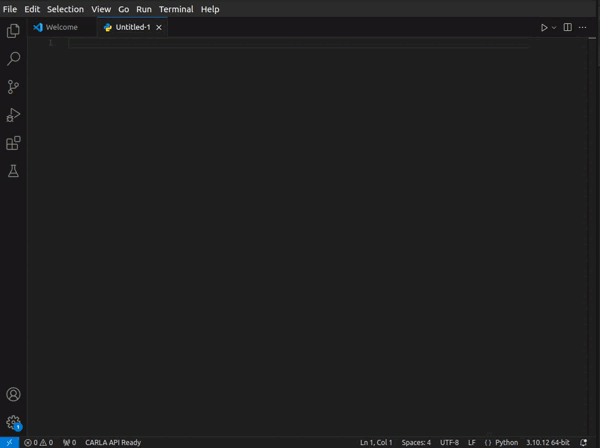

# Visual Studio Code 的 HUTB API 扩展

此扩展为 Visual Studio Code 中的 CARLA 自动驾驶模拟器 API 和 AirSim API 提供智能代码完成、文档和 IntelliSense 支持。

## 特性

### 智能代码补全
- CARLA 类、方法和属性的上下文感知补全
- Automatically shows relevant methods and properties when typing class names
- Rich documentation preview in completion items



### 方法签名帮助
- Real-time parameter information while typing method calls
- Parameter types and default values
- Documentation for each parameter

### 悬停文档
- Detailed documentation on hover for classes, methods, and properties
- Shows method signatures and return types
- Displays access information for properties (read/write)

### 智能上下文检测
- Shows only relevant completions based on context
- Class suggestions when starting a new statement
- Method and property suggestions only for the current class being typed

## 要求

- Visual Studio Code version 1.94.0 or higher
- Python extension for VS Code
- CARLA Python API installed in your environment (optional)

## 安装

1. 通过 VS Code 安装扩展：
   - Open VS Code
   - Go to Extensions (Ctrl+Shift+X)
   - Search for "CARLA API"
   - Click Install

2. 或者，下载 VSIX 文件并手动安装：
   ```bash
   code --install-extension carlaapi-0.0.1.vsix
   ```

## 使用

编辑 Python 文件时，该扩展程序会自动激活。以下是主要功能的使用方法：

1. **Class Completion**
   - Start typing a CARLA class name
   - Press Ctrl+Space to see available classes
   
2. **Method and Property Completion**
   - Type a class name followed by a dot (e.g., `Actor.`)
   - Completions will automatically show available methods and properties
   
3. **Signature Help**
   - Type an opening parenthesis after a method name
   - Signature help will show parameter information
   - Use commas to navigate through parameters

## 示例

```python
# 该扩展将提供补全和文档
world = client.get_world()  # 显示 World 类的方法
actor = world.spawn_actor()  # 显示 spawn_actor 参数
```

## 已知的问题

- Method overloads are currently not supported
- Some complex type hints might not be parsed correctly
- Documentation might be incomplete for some CARLA API methods

## Troubleshooting

If you encounter any issues:

1. Ensure you have the latest version of VS Code installed
2. Check that the Python extension is installed and configured
3. Verify that your CARLA Python API is properly installed
4. Try reloading VS Code if completions don't appear

## 贡献

1. Fork 该仓库

``` bash
   git clone  https://github.com/OpenHUTB/vscode_ext
```

2. 创建一个特性分支
3. 提交(commit)你的修改
4. 推送(push) 到特性分支
5. 创建拉取请求(Pull Request)

## 发布到市场

参考 [链接](https://juejin.cn/post/7402800227810852900) 。
1.下载并安装 [node 20](https://nodejs.org/en/download) ；并安装`vsce`
```shell
npm i -g vsce
```

2.打包成`vsix`：
```shell
vsce package
```

3.测试

4.登录：
```shell
vsce login OpenHUTB
```
输入 Token 。

5.发布
```shell
vsce publish
```

等待几分钟就可以在 [扩展的链接](https://marketplace.visualstudio.com/items?itemName=OpenHUTB.hutbapi) 、[Hub的链接](https://marketplace.visualstudio.com/manage/publishers/OpenHUTB/extensions/hutbapi/hub) 中看到插件


## 发行说明

### 0.0.1 - Initial Release
- Basic completion for CARLA API classes
- Method and property suggestions
- Signature help
- Hover documentation
- Context-aware completions

## 计划的功能

- Support for method overloads
- Improved type hint parsing
- Integration with CARLA documentation
- Quick actions for common CARLA operations
- Code snippets for common patterns

## 许可证

This extension is licensed under the MIT License. See the LICENSE file for details.

## 致谢

- CARLA Simulator team for their excellent documentation
- VS Code extension development community
- [carlaApiExtension](https://github.com/OpenHUTB/vscode_ext)

## 支持

对于错误报告和功能请求，请使用 GitHub 问题跟踪器：

[https://github.com/OpenHUTB/vscode_ext/issues](https://github.com/OpenHUTB/vscode_ext/issues)

---

**Enjoy using the CARLA API Extension!**
